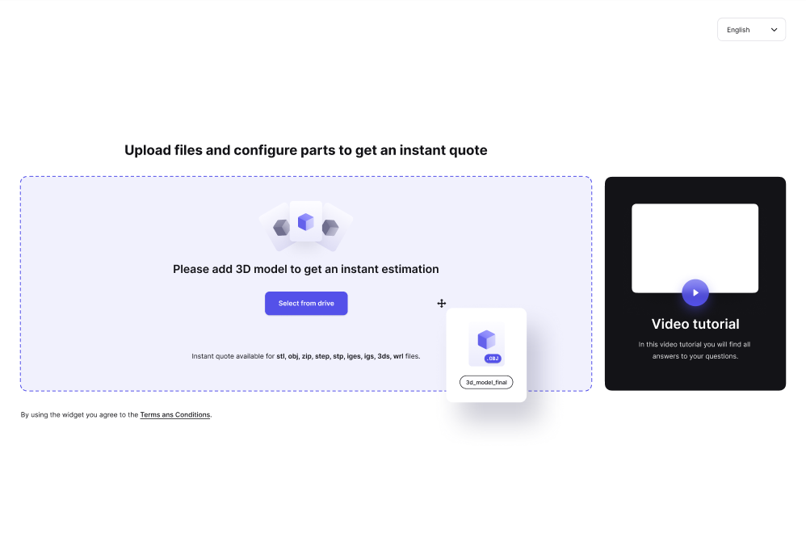
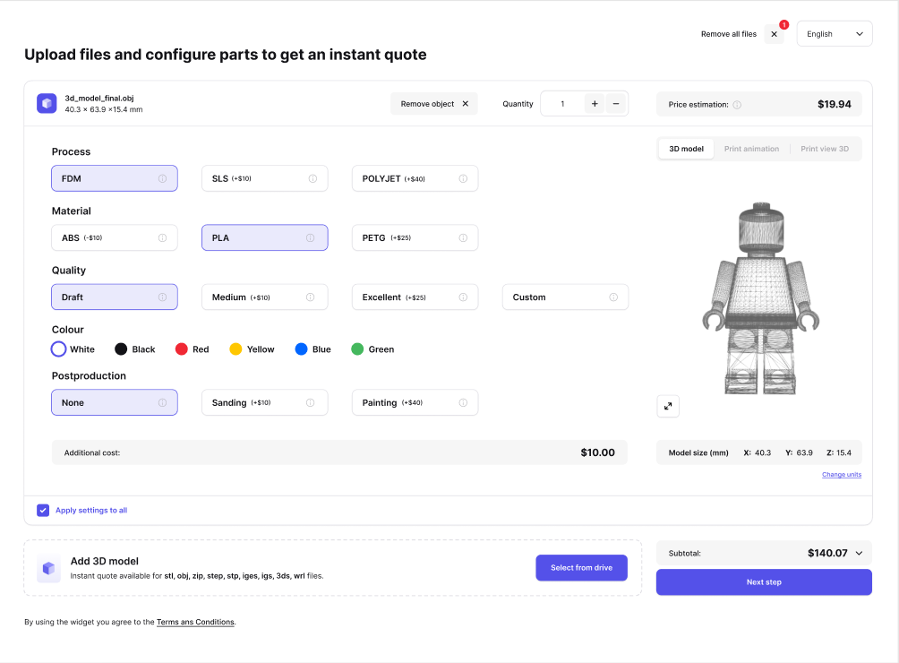
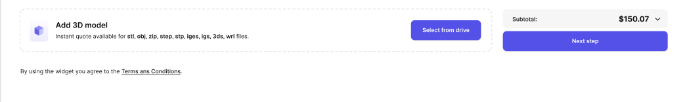
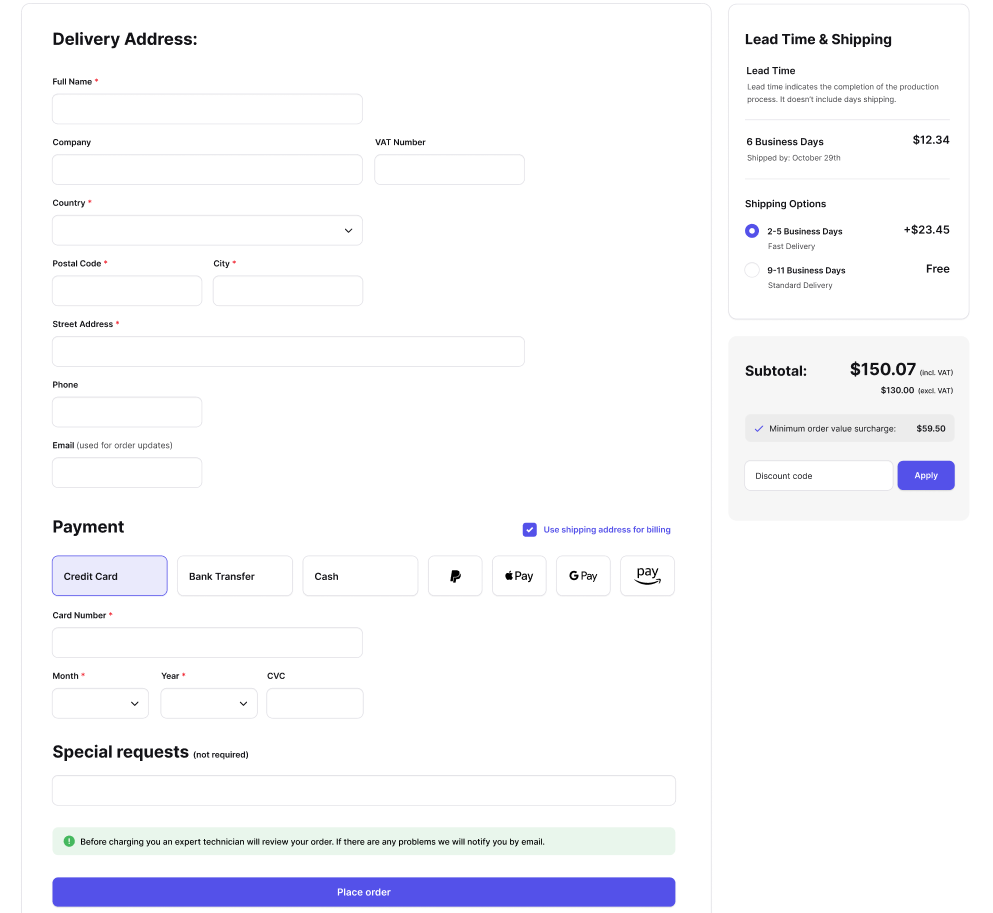

# User Flow

## Screen 1 - Upload files



### Upload files (new order)
[POST /get-signed-urls](../reference/ctq-widget-api.v1.yaml/paths/~1get-signed-urls/post)

## Screen 2 - Configuration



### Get settings and info

[GET /info](../reference/ctq-widget-api.v1.yaml/paths/~1info/get)

### Get order

[GET /orders/{order_id}](../reference/ctq-widget-api.v1.yaml/paths/~1orders~1%7Border_id%7D/get)

Cost differences (shown in brackets) are only supported for materials.

Following parameters will only be available if the model is sliced at least once ([PATCH /orders/{order_id}](../reference/ctq-widget-api.v1.yaml/paths/~1orders~1%7Border_id%7D/patch) request with ```process_id```, ```material_id``` and ```quality_id``` has been sent):
- model size
- model thumbnails
- material cost differences
- any of the settings selected (```process_id```, ```material_id```, ```quality_id```, ```color_id```, ```postproduction_id```)

### Update order - slicing for the first time

[PATCH /orders/{order_id}](../reference/ctq-widget-api.v1.yaml/paths/~1orders~1%7Border_id%7D/patch)

Used after successful upload of the model. 

```process_id```, ```material_id``` and ```quality_id```
are required for the first time slicing. These parameters can be obtained from ```default_settings``` (retrieved in [GET /info](../reference/ctq-widget-api.v1.yaml/paths/~1info/get))

### Update order - configuring parts

[PATCH /orders/{order_id}](../reference/ctq-widget-api.v1.yaml/paths/~1orders~1%7Border_id%7D/patch)

Every change in configuration is done by sending PATCH request. 

**Example**: Request body for item quantity change:
```{
  "items": [
    {
    "id": "item_id",
    "quantity": 2
    }     
  ]
}
```

*Apply settings to all* is done by sending PATCH request with all items (with the same settings) included in the body.

### Errors

```
500 Internal Server Error
{
  "error": "Info has been changed"
}
```

If the listed error is returned as response, following subsequent requests should be used to fetch the new data: 
- [GET /info](../reference/ctq-widget-api.v1.yaml/paths/~1info/get)
- [GET /orders/{order_id}](../reference/ctq-widget-api.v1.yaml/paths/~1orders~1%7Border_id%7D/get)

This error may occur in:
*(list will be updated)*
- [PATCH /orders/{order_id}](../reference/ctq-widget-api.v1.yaml/paths/~1orders~1%7Border_id%7D/patch)


### Remove object

[DELETE /orders/{order_id}?item_id={item_id}](../reference/ctq-widget-api.v1.yaml/paths/~1orders~1%7Border_id%7D/delete)

### Remove all files

[DELETE /orders/{order_id}](../reference/ctq-widget-api.v1.yaml/paths/~1orders~1%7Border_id%7D/delete)


## Screen 2 - Add 3D model



### Upload files (add to existing order)

[POST /get-signed-urls?order_id={order_id}](../reference/ctq-widget-api.v1.yaml/paths/~1get-signed-urls/post)


## Screen 3



### Apply discount

[POST /orders/{order_id}/apply-discount/{code}](../reference/ctq-widget-api.v1.yaml/paths/~1orders~1%7Border_id%7D~1apply-discount~1%7Bcode%7D/post)

### Place order

[POST orders/{order_id}/place-order](../reference/ctq-widget-api.v1.yaml/paths/~1orders~1%7Border_id%7D~1place-order/post)

Supported countries, shipping options, minimum order value surcharge, subtotal (including and excluding vat) are retrieved in [GET /info](../reference/ctq-widget-api.v1.yaml/paths/~1info/get) and [GET /orders/{order_id}](../reference/ctq-widget-api.v1.yaml/paths/~1orders~1%7Border_id%7D/get).
