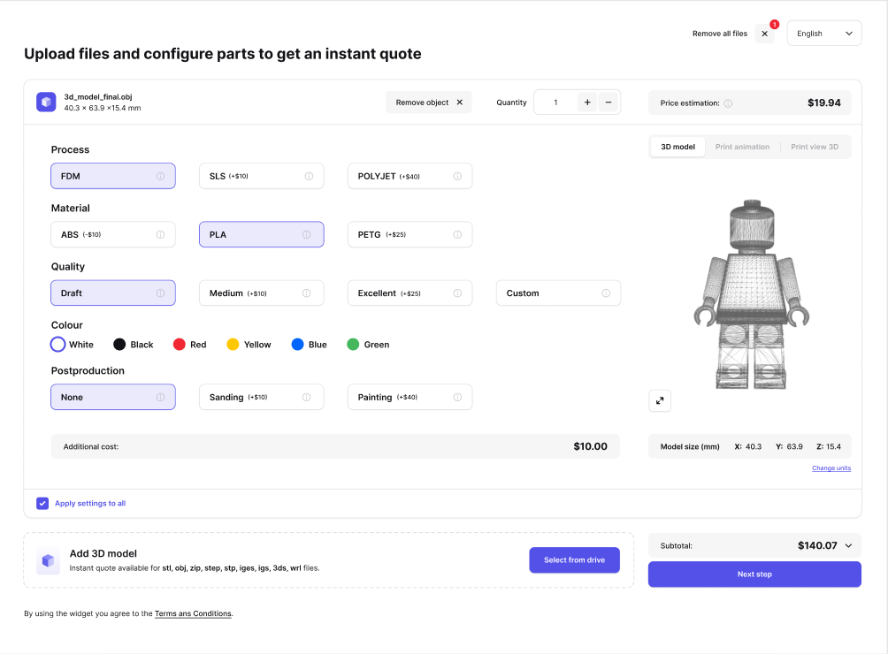
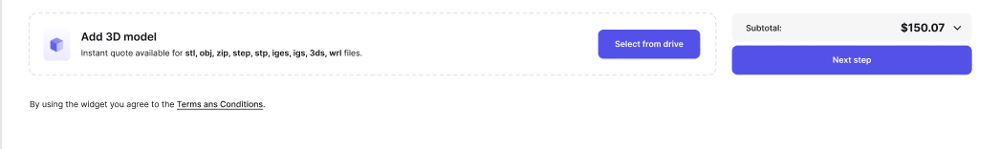

# User Flow

## Screen 1 - Upload files

### Upload files (new order)
```
POST /get-signed-urls
```
[POST /get-signed-urls](../reference/ctq-widget-api.v1.yaml/paths/~1get-signed-urls/get)


## Screen 2 - Configuration



### Get settings and info
```
GET /info
```
### Get order
```
GET /orders/{order_id}
```
Cost differences (shown in brackets) are retrieved after initial slicing. Cost differences are only supported for materials.

### Update order - slicing for the first time
```
PATCH /orders/{order_id}
```
Used after successful upload of the model. 

```process_id```, ```material_id``` and ```quality_id```
are required for the first time slicing. These parameters can be obtained from ```default_settings``` (retrieved in ```GET /info request```)

### Update order - configuring parts
```
PATCH /orders/{order_id}
```
Every change in configuration is done by sending PATCH request. 

**Example**: Request body for item quantity change:
```
{
  "items": [
    {
    "id": "item_id",
    "quantity": 2
    }     
  ]
}
```

*Apply settings to all* is done by sending PATCH request with all items (with the same settings) included in the body.

### Remove object
```
DELETE /orders/{order_id}?item_id={item_id}
```
### Remove all files
```
DELETE /orders/{order_id}
```

## Screen 2 - Add 3D model



### Upload files (add to existing order)
```
POST /get-signed-urls?order_id={order_id}
```

## Screen 3


### Apply discount
```
POST /orders/{order_id}/apply-discount/{code}
```
### Place order
```
POST orders/{order_id}/place-order
```
Supported countries, shipping options, minimum order value surcharge, subtotal (including and excluding vat) are retrieved in ```GET /info``` and ```GET /order```.


